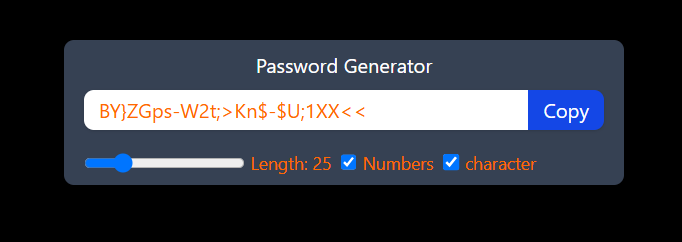

# Password Generator

A simple and responsive password generator built using React. This app allows users to generate strong passwords with customizable length and the option to include numbers and special characters.

## Features
- Generate strong passwords instantly
- Adjustable password length (6 to 100 characters)
- Option to include numbers and special characters
- One-click copy to clipboard
- Responsive and minimal UI

## Preview

## Installation

1. Clone the repository:
   ```bash
   git clone https://github.com/yourusername/password-generator.git
   ```
2. Navigate to the project folder:
   ```bash
   cd password-generator
   ```
3. Install dependencies:
   ```bash
   npm install
   ```

## Usage

Run the development server:
```bash
npm run dev
```

Then open [http://localhost:3000](http://localhost:3000) in your browser.

## Deployment
To deploy the project, you can use:
```bash
npm run build
```
Then host the `build` folder on any static hosting provider like Vercel, Netlify, or GitHub Pages.

## Technologies Used
- React
- Tailwind CSS


## Author
[Pushpraj Desai](https://github.com/Pushpraj1522002)

## Courtesy
Inspired by [Chai Aur Code](https://youtu.be/AFDYnd-XPa8?si=o0aEU-qMw0lHWN0W)


